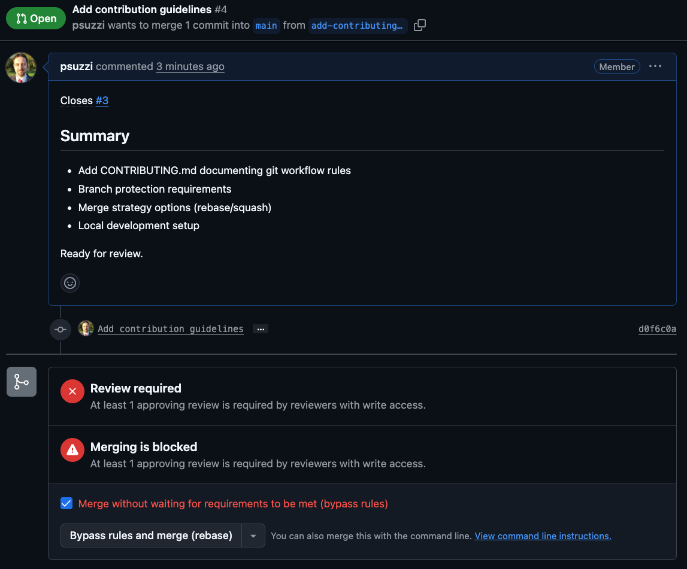

# Contributing

## Git Workflow

### Branch Protection

- `main` branch is protected
- Direct pushes to `main` are not allowed
- All changes require a pull request with 1 approval

### Merge Strategy

Two options available when merging PRs:

- **Rebase and merge** - preserves individual commits, maintains linear history (preferred for most cases)
- **Squash and merge** - condenses multiple commits into one (use when commit history is too granular)

Regular merge commits are disabled.

### Local Development

Configure your local repo to use rebase:

```bash
git config pull.rebase true
```

### Administrator Privileges

Administrators have special capabilities to keep development moving:

- **Cannot** push directly to `main` (branch protection prevents this)
- **Can** approve and merge their own PRs using the "bypass rules" option
- Should use bypass sparingly - only when working solo or in urgent situations

When merging your own PR as an administrator, you'll see this option:



Check the "Merge without waiting for requirements to be met (bypass rules)" box to proceed.

### Workflow

1. Create an issue describing the work
2. Create a branch from `main` to address the issue
3. Make your changes and commit locally
4. Push the branch to remote
5. Create a pull request referencing the issue
6. Wait for review and approval (or use admin bypass if working solo)
7. Merge using rebase or squash as appropriate
